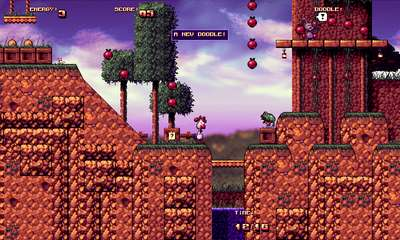
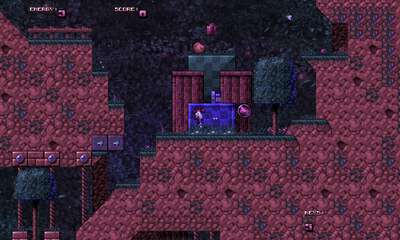
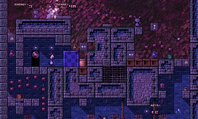
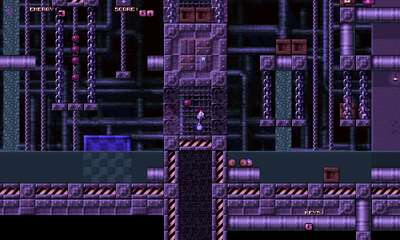

Pekka Kana 2
============

This is a WebAssembly port of Pekka Kana 2.

[Play the game in your browser here](https://gmh-code.github.io/pk2/).

Screenshots
-----------

   

Desktop Support
---------------

This version should run on almost any desktop platform with a modern web browser, such as:

- Windows
- Linux
- Mac OS
- ChromeOS
- ...and more

Use the following keyboard and mouse controls, which can be redefined in the menu:

    Left/Right Cursors - Move
    Up Cursor Key      - Jump
    Down Cursor Key    - Duck
    Left Shift         - Doodle attack
    Left Ctrl          - Egg attack
    Left Alt           - Walk
    Space              - Use item
    Esc                - Open in-game menu

If you are interested in building a standalone application, this project should be capable of compiling working desktop apps for Windows and Linux, but this is untested.

Mobile Support
--------------

This build supports browser-based multi-touch.  On-screen controls should work on most modern tablet or mobile devices with a touch screen, including:

- Android phones and tablets
- iOS phones and tablets
- Windows tablets

Please note that if you are using Android, the native app should always outperform the WebAssembly build because there is no browser overhead.

Do *not* enable touch controls if you are not using a touch screen device.  Doing so may make it difficult to navigate some screens, because the mouse cursor is removed and other controls are altered.

Loading / Saving
----------------

Saved games, high scores and settings are automatically stored in your browser's database and should persist between normal browsing sessions.

Android App Notes
-----------------

Android APK building is **not** included in this version, because there is already another project focussing on that.  It should be straightforward to re-merge the two projects if desired and updates on this project do consider compatibility with the other.  For Android builds and other updates, please refer to [Danilo Lemos](https://github.com/danilolc/pk2)' version.

Differences from Other Versions
-------------------------------

Pekka Kana 2 is in active development, already has an SDL2 backend, and this fork required few changes for the first successful run.  There should be almost no visual or game play differences from the current desktop and Android versions.

Renderer
--------

There are some differences regarding the display:

- Automatic fullscreen mode is not currently supported, but you can switch your browser into fullscreen mode manually.
- You can switch between linear and nearest neighbour resampling in the menu, if you prefer a sharper look.  The browser is asked to handle this, and it requires the (supplied) custom HTML template.

Audio
-----

### FastTracker 2 Music

This game contains 16 sequenced music tracks in FastTracker 2 (.xm) format.  These tracks are mixed and played in real-time.

### Ogg Vorbis and MP3

The default levels do not use these streaming formats, so support for them has been disabled to reduce download time.  Custom third-party levels that include these formats will instead play the default track from level 1 in the first episode.

### WAV

Waveform sound effects play as expected.

Additional Command-Line Arguments
---------------------------------

You can start Pekka Kana 2 with command-line arguments to enable different features.

Arguments unique to this version:
- `unlock` -- unlock all levels without entering full debug mode (useful if the browser database gets cleared)
- `touchscreen` -- switch to touchscreen mode and enable on-screen controls without assuming Android is the OS

Other useful arguments include:
- `dev` -- developer mode (assumes `unlock`)
- `test <map_path/level_path>` -- skip to, and test a level

Note that this game requires no leading dash on any of the arguments.

Notes
-----

- You cannot change the player's name in the WebAssembly version when the touch controls are activated, so in that scenario the name entry screen will be skipped.  This is due to limited support for on-screen keyboard entry, which may be added later.

Building from Source
--------------------

Compiling this project is straightforward:

Download Emscripten's WebAssembly *emsdk* from https://emscripten.org/

Next, run these commands:

    cd <emsdk_path>
    ./emsdk install
    ./emsdk activate
    source emsdk_env.sh
    cd <pk2_source_path>
    emmake make

Emscripten will be detected and used during the build.  Afterwards, you will find `index.html`, `index.js`, `index.wasm` and `index.data` in the `bin` folder.  For best download time, pre-compress these files with GZip or Brotli and ensure your web server sends them to the client's browser as-is.

The entire game should be under 8MB when compressed.

Original Authors and Copyrights
-------------------------------

- (C) Janne Kivilahti (Piste Gamez), 2003 -- Original release
- Samuli Tuomola, 2010 -- First SDL port
- Danilo Lemos, 2016-2020 -- Android and SDL2 (this saved a lot of time)!

The original `README.md` is now named `README-old.md`.
